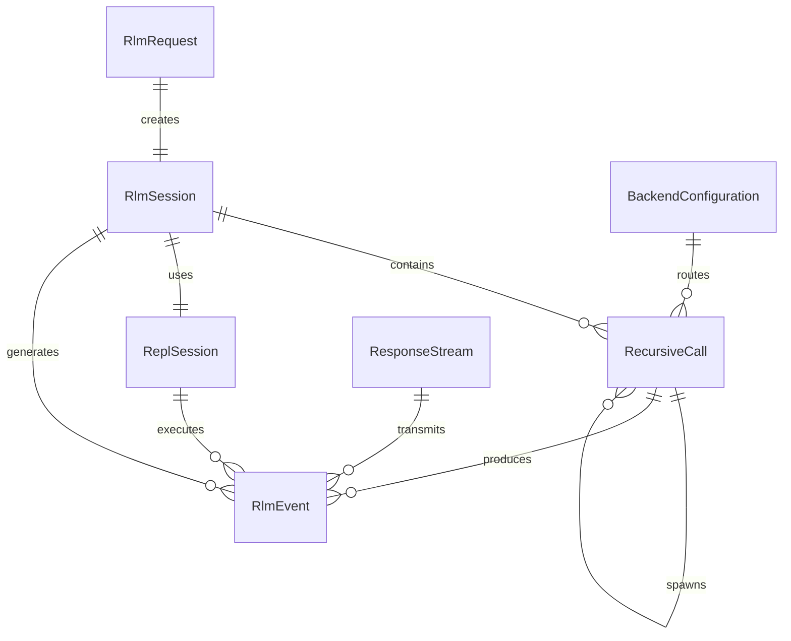

# Data Model: RLM OpenAI-Compatible Server

This document defines the core data entities, their relationships, and state transitions for the RLM server implementation.

## Core Domain Entities

### RLM Request
**Purpose**: Represents an incoming chat completion request with potential long context that requires RLM processing.

**Attributes**:
- `request_id`: Unique identifier for tracking and logging
- `model`: Target model name (e.g., "gpt-4", "gpt-5.2")
- `messages`: Vector of chat messages (user, assistant, system)
- `stream`: Boolean indicating streaming vs non-streaming response
- `max_tokens`: Optional token limit for response generation
- `temperature`: Sampling temperature (0.0 to 2.0)
- `top_p`: Nucleus sampling parameter
- `stop`: Stop sequences for response termination
- `created_at`: Request timestamp for tracking and timeout
- `context_size`: Total token count of input context

**Relationships**:
- Has one `RlmSession` for processing state
- Produces one or more `RlmEvent`s during processing
- Results in one `RlmResponse` upon completion

**State Transitions**:
```
Received → Validated → ContextAnalyzed → Processing → Completed/Failed
```

**Validation Rules**:
- Model must be supported by configured backend
- Messages array cannot be empty
- Max tokens must be positive if specified
- Temperature must be within valid range [0.0, 2.0]

### Recursive Call Tree
**Purpose**: Hierarchical structure tracking sub-LLM invocations with parent-child relationships and token usage.

**Attributes**:
- `call_id`: Unique identifier for this call node
- `parent_id`: Optional reference to parent call (None for root)
- `depth`: Recursion depth (0 for initial request)
- `prompt`: Prompt sent to sub-LLM
- `response`: Response received from sub-LLM
- `tokens_used`: Token count for this specific call
- `duration_ms`: Processing time for this call
- `created_at`: Call initiation timestamp
- `completed_at`: Call completion timestamp
- `status`: Current call status (Pending, InProgress, Completed, Failed)

**Relationships**:
- Belongs to one `RlmSession`
- Has optional parent `RecursiveCall` (self-referential)
- Has zero or more child `RecursiveCall`s (tree structure)
- Associated with `RlmEvent`s for progress tracking

**State Transitions**:
```
Created → Queued → InProgress → [Completed | Failed | Timeout]
```

**Tree Constraints**:
- Maximum depth configurable (default: 10 levels)
- Maximum children per node to prevent fan-out explosion
- Cycle detection to prevent infinite recursion

### REPL Session
**Purpose**: Sandboxed Rhai environment containing offloaded context data and intermediate processing state.

**Attributes**:
- `session_id`: Unique session identifier
- `context`: Large context data stored in REPL scope
- `variables`: Map of Rhai variables and their current values
- `execution_history`: Log of all executed code snippets
- `memory_usage_bytes`: Current memory consumption
- `max_operations`: Operation limit for safety
- `last_activity`: Timestamp of last REPL operation
- `status`: Session status (Active, Suspended, Expired, Error)

**Relationships**:
- Belongs to one `RlmSession`
- Contains multiple `RlmEvent::ReplOp` events
- Stores context for multiple `RecursiveCall`s

**State Transitions**:
```
Created → Active → [Suspended | Completed | Expired | Error]
```

**Resource Management**:
- Automatic garbage collection when memory limits exceeded
- Session timeout after inactivity period
- Scope isolation between concurrent sessions

### Backend Configuration
**Purpose**: Connection settings, authentication, and routing information for underlying LLM services.

**Attributes**:
- `provider_type`: Backend type (OpenAI, Azure, Local, etc.)
- `base_url`: API endpoint URL
- `api_key`: Authentication credentials
- `model_mapping`: Map of logical to physical model names
- `retry_policy`: Retry configuration (max attempts, backoff)
- `rate_limits`: Request rate limiting parameters
- `timeout_ms`: Request timeout configuration
- `health_check_url`: Endpoint for backend health monitoring

**Relationships**:
- Used by `LlmProvider` implementations
- Referenced in `RecursiveCall` for backend routing
- Associated with `BackendHealth` monitoring data

**Configuration Validation**:
- URL format validation
- API key encryption at rest
- Model availability verification
- Connection health checks

### Processing Events
**Purpose**: Structured log entries and metrics for context processing, recursive calls, and performance monitoring.

**Attributes**:
- `event_id`: Unique event identifier
- `request_id`: Associated request for correlation
- `event_type`: Event classification (ReplOp, RecursiveCall, Chunk, etc.)
- `timestamp`: Event occurrence time
- `duration_ms`: Optional processing duration
- `metadata`: Type-specific event data (JSON)
- `trace_id`: Distributed tracing correlation ID
- `span_id`: Tracing span identifier

**Event Types**:
```rust
enum RlmEventType {
    ReplOp {
        iteration: u32,
        code: String,
        result: ReplResult,
    },
    RecursiveCall {
        call_id: String,
        depth: u32,
        prompt_tokens: u32,
        completion_tokens: u32,
    },
    Chunk {
        content: String,
        chunk_index: u32,
        is_final: bool,
    },
    ContextChunk {
        chunk_id: String,
        size_bytes: usize,
        processed: bool,
    },
    Done {
        total_tokens: u32,
        total_duration_ms: u64,
    },
    Error {
        error_type: String,
        message: String,
        recoverable: bool,
    },
}
```

**Relationships**:
- Belongs to one `RlmSession` or `RecursiveCall`
- Consumed by `EventSink` implementations (SSE, logs, metrics)
- Used for real-time monitoring and debugging

### Response Stream
**Purpose**: Server-sent event stream delivering incremental results and processing status to clients.

**Attributes**:
- `stream_id`: Unique stream identifier
- `client_id`: Connected client identifier
- `connection_time`: Stream establishment timestamp
- `last_event_time`: Most recent event sent
- `event_count`: Total events transmitted
- `buffer_size`: Current event buffer size
- `status`: Stream status (Active, Completed, Disconnected, Error)

**Event Format** (OpenAI-compatible):
```json
{
  "id": "event-uuid",
  "object": "chat.completion.chunk",
  "created": 1642787200,
  "model": "gpt-4",
  "choices": [{
    "index": 0,
    "delta": {"content": "partial text"},
    "finish_reason": null
  }]
}
```

**Custom RLM Events**:
```json
{
  "id": "rlm-event-uuid",
  "object": "rlm.processing.chunk",
  "created": 1642787200,
  "data": {
    "type": "recursive_call",
    "depth": 2,
    "progress": "45%",
    "message": "Processing sub-query 3 of 7"
  }
}
```

**Stream Management**:
- Connection heartbeat to detect disconnections
- Buffering for client reconnection scenarios
- Graceful termination with `[DONE]` marker

## Entity Relationships



## State Management

### Session Lifecycle
```
RlmRequest → RlmSession [Created]
  ↓
Context Analysis → RlmSession [ContextLoaded]
  ↓
REPL Initialization → ReplSession [Active]
  ↓
Recursive Processing → RecursiveCall [Tree Building]
  ↓
Result Aggregation → RlmSession [Aggregating]
  ↓
Response Generation → RlmSession [Completed]
```

### Error Handling States
- **Recoverable Errors**: Retry with exponential backoff
- **Fatal Errors**: Immediate termination with error response
- **Timeout Errors**: Graceful cleanup and partial result return
- **Resource Exhaustion**: Session suspension and cleanup

## Performance Considerations

### Memory Management
- REPL sessions automatically cleaned up after inactivity
- Large contexts stored with lazy loading and garbage collection
- Recursive call trees pruned when depth limits exceeded

### Concurrency
- Each RLM session is isolated and thread-safe
- Backend connections pooled and shared across sessions
- Event streams use broadcast channels for fan-out efficiency

### Monitoring
- Token usage tracking for cost estimation
- Processing time metrics for performance optimization
- Error rate monitoring for reliability assessment
- Memory usage tracking for resource management

This data model provides the foundation for implementing the RLM server's core functionality while maintaining clear separation of concerns and supporting the complex processing requirements of recursive language modeling.